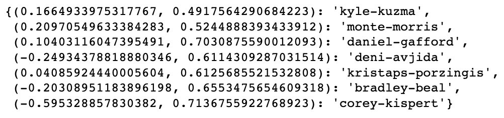

# **Price-of-anarchy-in-basketball**
## **Global optimum shooting strategy for Washington Wizard in 2022-23 Season for Utility maximisation**

---

### **Introduction**

Basketball is a sport played by two teams of five players each, where the objective is to shoot a ball through a hoop mounted 10 feet high on a backboard at either end of a rectangular court. The team with the most points at the end of the game, which is typically divided into four quarters, wins. Points are scored by shooting the ball through the hoop, with a shot made from within the three-point line counting as two points and a shot made from beyond the three-point line counting as three points. Players move the ball by passing it to their teammates or dribbling it, which involves bouncing the ball on the floor while moving.

Basketball is a team sport but many times players are motivated by individual achievements which helps the team too. Players might be motivated to show their individual brilliance to get a new contract or they might want to move to a more popular team. We will see in later sections how basketball is similar to a network flow problem and even if every pass goes through the best player, it might be a short-sighted approach and might not lead to the global optimum result. Now we know that although players might want to get the best for their team and they might think that their contribution is more important than any other player. The best player might think that if they take all the shots, the overall team score will be maximum. We will show that it is not the optimal strategy. The difference between the score obtained using the perceived best strategy and the actual global maximizing strategy is called the Price of Anarchy in basketball. We will look at the problem from the game theoretic perspective by first defining several key terms and then diving into the model.

### **Key basketball terminologies**

We will only look at the terms which are used in our model. The terms might not be used in basketball by players but they are used by basketball analysts on a regular basis.

* **FTA:** Free throw attempts, when a player is fouled they can take the shot without any interference by opposing players. This gives the total number of free throw attempts.
* **FGA:** Field goal attempts, when a player takes the shot from anywhere in the field. This gives the total number of field goal attempts.
* **PS:** Point scored, total points scored by a player. This can be defined per game or per season. PS will always mean per game unless stated otherwise.
* **TS:** Total shots, these are the number of shots a player takes in each game. It is equal to the sum of FTA and FGA.
* **TSA:** True shooting percentage, is a term defined by Kubotko, Justin et al [1] which is calculated as follows: 

* **Percentage of total shots:** this is equal to the percentage of shots each player takes against the overall number of shots. It is dependent on the minutes played and total team shots.

### **Data processing**

Data was collected from https://www.basketball-reference.com/ . We looked at each player’s data and converted it to the CSV corresponding to the 2022-23 season. 

There were a total of 30 features for each player and for every match day. We further chopped down a few features, some main features in our final data are:

1. MP (minutes played)
2. GS (games started)
3. FGA (field goal attempts)
4. FTA (free throw attempts)
5. PTS (points scored)

There are players who would have not played the match due to various reasons. These are represented as a string like “Inactive”, “Did Not Play”, “Did Not Dress” or “Not With Team”. We removed all the rows from the dataset which had these strings in them for any of the included columns. We further cleaned the dataset by considering only those occurrences where the player played for more than 10 minutes. We created an aggregate dataset that was grouped by match day. It will help us to find the data corresponding to each match day.

We created three new columns TSA,  TS, and percentage_of_shots, descriptions for these are given in the key terminologies section which will be utilized in our proposed model.

### **Game theoretic perspective**

Let's say there are ten cars that need to travel from point A to point B. There are two roads connecting A and B, as shown in the figure above. The upper road, labeled as L1, is a wide highway that takes ten minutes to travel on, regardless of the number of cars using it. The duration L1 of a driver's commute on this highway is a constant, 

L1(x1) = 10, 

irrespective of the number of cars x1 using it. The lower road, labeled as 2, is a narrow alley that is more direct but can become significantly slower with heavy traffic. The duration of a commute along the alley depends on the number of cars x2 that use it, such that 
L2(x2) = x2. 

If one car takes the alley, then the commute takes 1 minute. If two cars take the alley, then they each have a 2-minute commute, and so on. 

It may seem that there is no reason for anyone to take the highway, as the alley takes a maximum of ten minutes, while the highway always takes ten minutes. Therefore, it's in the best interest of all ten drivers to take the alley, resulting in an average commute time of 10, known as the "Nash equilibrium". In general, the Nash equilibrium is the state where no individual can improve their situation by making a different choice, and each driver has the same length of commute. 
However, in this particular case, the Nash equilibrium is not the best possible outcome for the drivers. For any usage levels x1 and x2 of the two roads, the average commute length can be lower than 10 minutes.

We can see that the optimum strategy in the above example is when the roads are used in equal proportion even when they are not of equal levels. The Nash equilibrium would have made all the vehicles go through the alley which is not optimal. The difference between the “selfish” Nash equilibrium and the global optimum is called the Price of Anarchy.

Optimizing the performance of a basketball offense may be viewed as a network problem like the above example, wherein each play represents a “pathway” through which the ball and players may move from the origin (the inbounds pass) to the goal (the basket). Effective field goal percentages from the resulting shot attempts can be used to characterize the efficiency of each pathway. We are assuming that each player is playing selfishly to maximize the team’s score. We won't be calculating the score but a number that we would call utility. The maximum utility one can achieve is 1, which is when all the players have 100% shooting accuracy. The utility will be correlated to the maximum points a team can score. The Nash equilibrium in basketball can be compared to the strategy where every player is taking a shot and want to contribute equally to the team’s overall utility. They want to maximize the team’s utility at the cost of maximizing their own utility as well. We will look at other models followed by our proposed model.

### **Modeling of player’s shooting behavior**

We have already created new columns as part of data processing which is TSA and percentage of total shots. We plotted a regression model to understand the change in TSA as compared to the percentage of overall shots a player take. It can be a common understanding that the TSA will have a direct negative correlation with the player taking more and more shots. From the linear regression model, we got two parameters corresponding to each player i.e. slope and intercept. Intercept tells us the TSA of a player when they just take one shot. An example of one of the players Bradley Beal is given below:

### **Simulation model**

For the sake of simplicity we only considered the offensive action. We are not looking at any passing but just the final shot by a player. The simulation was done on two sets of players. One set contained all the players who started more than 30 games in the 2022-23 season, the second set contained all the players without any restriction. 

A player’s regression model is a line that can be shown by, 

Where y is the value of TSA, and x is the percent of team shots a player take. Now if a player takes x1 % shots, then the contribution to the team’s utility by that player can be denoted by

Similarity for 5 players would be:

So the overall team utility is given by:

We need to maximize the function F with some constraints which are defined below:

We considered 4 different scenarios for each set of players:

1. Players play considering they want their contribution to the overall utility to be equal, which is also a Nash equilibrium in this case
2. Players play with everyone taking an equal percentage of shots i.e. 20% each
3. The player with the best intercept value in their regression model takes the majority of the shots.
4. Proposed model where players distribute the % of shots among themselves to maximize the overall team utility

#### **Simulation model with only experienced players**

The total number of players who started more than 30 games was only 7. The player's TSA model values are given below where the first value is the slope and the second value is the intercept.

On running the model simulating every possible choice of 5 among all the available players we get the following result.

##### **Model comparison**
On comparing the models, we can say that the proposed model works the best to maximize the overall team utility.

#### **A simulation model with all the available players**

There is a total of 14 available players who satisfied our initial filtering. There were a total of 2002 potential groups, the simulation ran for 4 different models to compare the result. We found that the result obtained by our approach was better than the second-best by at least 9%.

##### **Model comparison**

### **Future Work**

We only took data from last season. The accuracy of the model will improve with more historical data. We can do the following in our future iterations:

1. Obtain more historical data
2. Work on a better model to model player’s TSA with % of team shots taken.
3. In this work we only considered offensive work, we can factor in defensive work to the player’s TSA and see the results.
4. We can take into consideration the power a player uses, it takes more effort for a FGA as compared to a FTA.

### **References**

1. Kubatko, Justin et. al., “A Starting Point for Analyzing Basketball Statistics”, Journal of Quantitative Analysis in Sports, 2007, Vol. 3, Issue
2. Roughgarden, T., Selfish Routing and the Price of Anarchy, 2005, MIT Press, Cambridge.
3. Data collected: https://www.basketball-reference.com/
4. Basic basketball details: https://en.wikipedia.org/wiki/Basketball
5. “Price of anarchy in basketball” Skinner, Brian, https://arxiv.org/abs/0908.1801v4

---
